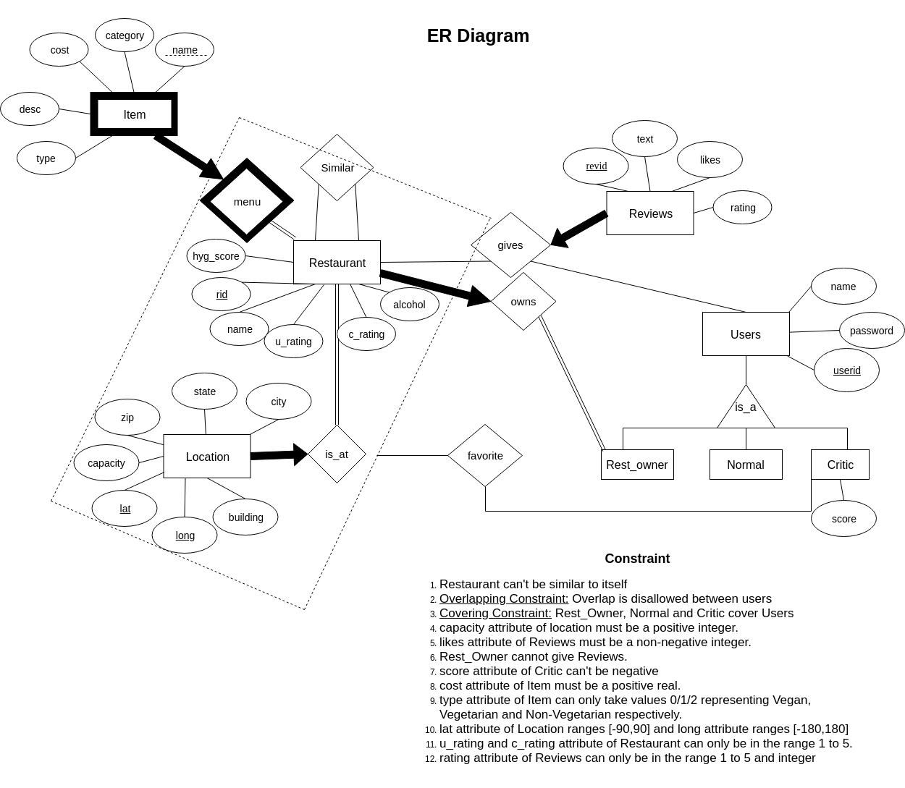

# Project 1 Group 5

## Manik Goyal (mg4106) and Raghav Jindal (rj2571)

Postgresql Account - mg4106

The URL of the webiste - [http://35.231.187.42:8111/](http://35.231.187.42:8111/)

## Features of our project Implemented

* __Restaurant Rating and Review__ - Each Restaurant has its own page with both critic reviews and user reviews. Along with the menu of the restaurant.
* __Likes__ - The website gives the option to users to like reviews (other than his own). This directly affects the critics score.
* __Similar Restaurant__ - Similar Restaurants are grouped based on similar features and are displayed on the restaurant page.
* __Nearby Restaurant__ - With each location of a restaurant displayed, the users have the ability to view the top 5 nearby restaurants.
* __Create Account__ - We provide users the ability to create a normal user account or a critic account.
* __Add Review__ - Each user (critic/normal) has the ability to give review to a restaurant along with a rating.
* __See Critic History__ - Each critic gets its own page where users can go and view critic review history. Critics also get a score based on the number of likes they received on their reviews. We also display critic's favourite restaurants on this page.
* __Favourite__ - Critics have the ability to mark a restaurant locaton as their favourite on the restaurant page. These favourite restaurant's are shown on the citics page
* __Restaurant Owner__ - Each Restaurant owner gets their own login account through which they can update the restaurants menu item or add new menu items.

## Feature Modified from proposal

* __Nearby Restaurant__ - We did not implement nearby restaurants based on user's current location since, it was difficult to test. Instead we modified it as top 5 nearby restaurants to a given restaurant.
  
## New Feature Added

* __Search__ - We provide a name based search on the home page.

Q) Briefly describe two of the web pages that require (what you consider) the most interesting database operations in terms of what the pages are used for, how the page is related to the database operations (e.g., inputs on the page are used in such and such a way to produce database operations that do such and such), and why you think they are interesting.

## The two web pages are as follows

1. [http://35.231.187.42:8111/restaurants/1/](http://35.231.187.42:8111/restaurants/1/)

    **Description**: This is the most useful web page in our project. Most of the updates take place via this page. This webpage gives the details of a restaurant. Each restaurant has a separate web page made on the same pattern. The page contains the different locations of a restaurant, the reviews of different users (and critics) for the restaurant along with the rating for the restaurant and the total number of likes for the reviews. The menu items and their description is also provided. Finally, we provide hyperlinks to the webpages of similar restaurants.

    **Interactions**: The page can be opened in three different ways: user login, critic login, restaurant owner login. Each of these 3 types of “views” has different interactions associated with them. When the page is viewed without any login, you are in “read-only” mode. When a user or a critic logs-in, he can like the reviews (cannot like his own review!), add a new review. A critic also has the ability to make a restaurant location as his favourite. The reviews of users and critics are displayed in separate tables as the critic is expected to give a much more in-depth review. When the owner of the restaurant logs-in, he is allowed to add or update the menu items.

    **Inside the database:**
    * We retrieve the id of the restaurant from the URL.
    * Locations - natural join of locations table with the restaurant id.
    * Normal /Critic Reviews - 3 way join with the review id (reviews table), restaurant id (restaurant table) and normal /critic table.
    * Menu Items - natural join between restaurant table and menu items table.
    * Similar restaurants - simple retrieve operation from the corresponding table.
    * Like a review - first retrieve the user id corresponding to the review (review natural join with normal table), check that this user id should not be same as the id of the person who is logged in, then increase the number of likes.
    * Add a review - check that the user or critic should have logged in, then add the review assigning the primary key on the backend and store it in the database.
    * Update a new menu item - check if the restaurant owner is logged in. Get the ‘id’ of the menu item (Note: menu table is a weak entity having name as the partial key) which is its name, the updated value is put in the database table by getting the restaurant id and the menu item name.
    * Add a new menu item - check if restaurant owner is logged in. If yes, allow him to add a new menu item.
    * Favourite - check if the critic has logged in. If yes, display buttons allowing critics to make a restaurant location as favourite. This is then stored into the favourite table in the database and is displayed on the critic page (explained below).

2. [http://35.231.187.42:8111/critics/c1/](http://35.231.187.42:8111/critics/c1/)

    **Description**: This is the profile page of critic. The user can reach this page by clicking on the critic’s name from the critic's review (described above). Here a person can see the reviews that the critic made, his score (based on the number of likes on his reviews) and the restaurants marked as favourite by the critic (Note: a critic can have more than one location of the same restaurant as favourite!). This can be helpful to decide which restaurant should a person go to.

    **Inside the database:**
    * __To display the reviews__ - Retrieve the reviews for the user id associated with the critic page opened and display them.
    * __Favourite restaurants__ - Retrieve the restaurant id from the location associated with the favourite restaurants (as critic can have favourite restaurant location instead of a favourite restaurant) by taking a natural join of the restaurant table with the locations table for the locations associated with the current critic id and display all of them.

## Note

The URL mentioned here was the url that we had when
hosting on google cloud. You will need to use localhost in its place.

